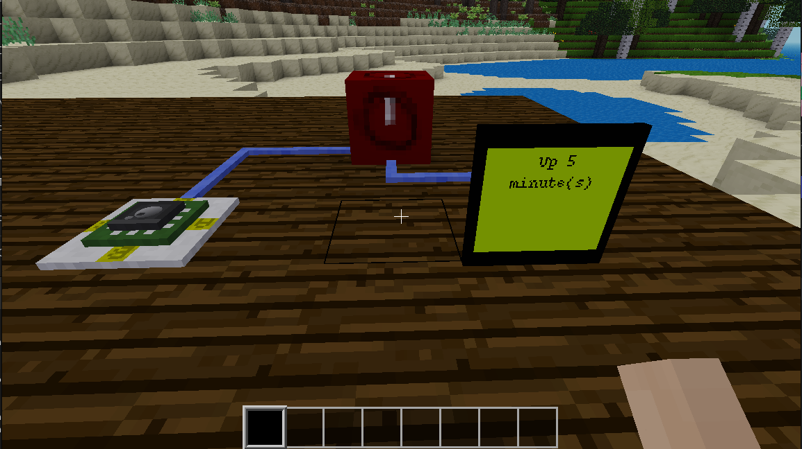

# Minetest Stats
A mod to allow real world data to be shown in game. It has the following blocks:

- real world time block
- server uptime block
- Active players block
- Positon block
- Time formatter block
- Uptime formatter block

## Status
- This Mod is a work in progress and is Alpha quality. All main features are completed but it needs more testing.

## Docs
- [doc.md](docs/doc.md)

## License
- [GPLv3](/LICENSE)